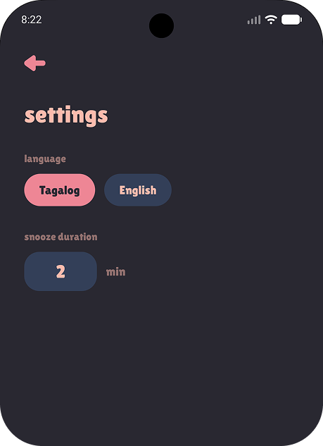
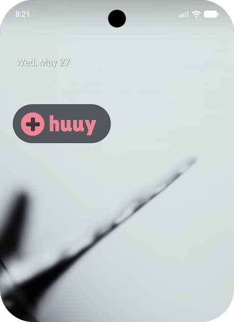
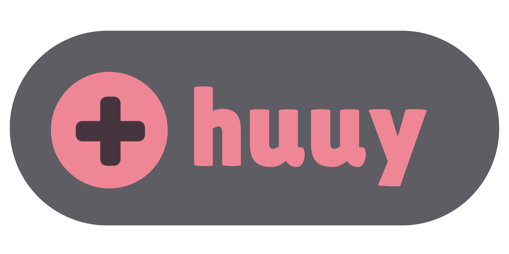
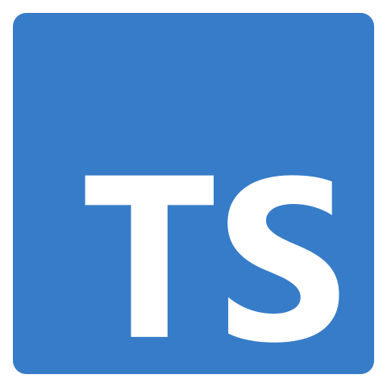
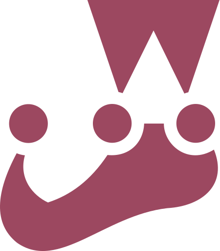

#  **- an app for your fleeting reminders**

### Now open for Beta Testers! <a href="https://huuy.aiveekei.com/join"></a> 
**For   only.** 

<hr>

I have this very important person in my life who proudly has a poor memory. _"I have always been like this,"_ she says. So, as a very present person in her life, we end up just sharing a single storage of memory (mine).

When she needs to remember things like chores or errands, she'll look at me and say:

**_"Remind me that I need to buy dog food later."_**<br>
**_"Remind me that I need to withdraw cash after work."_**<br>
**_And pick up the laundry. Buy rice. Buy meds. Buy water. Call the vet. Message my boss._**<br>

And I'll go, _"Yep, I'll remind you."_ Then I'll also forget.

So, I started setting alarms on my phone for her reminders. I'll create an alarm, set a name and time. When another reminder comes from her, I'll create another one or rename an already fired alarm. I end up with a cluttered alarm app, mixed with expired reminders and my actual wake-up alarms and whatnot.

### **The**  **app**

This is the reason I created this simple app. A place for my temporary reminders.

**1. I set the a reminder** ✅ <br> 
**2. Huuy reminds me** 👋 <br> 
**3. I click the trash button** ✨ <br> 

No more cluttered app, no more stale alarms. Be reminded once, and be done.

<table>
  <tr>
    <td align="center"></td>
    <td align="center"></td>
    <td align="center"></td>
  </tr>
</table>

<br>

<table>
  <tr>
    <td valign="top">
        This is a very personal app for me. That is why it is modeled on the actual words I hear every day, hence the Tagalog language. But don't worry! It is designed to be very intuitive, and you can easily <em><b>change the language</b></em> on the settings page! Currently, there are only 2 language options. If you want to use your own language for the app, feel free to send a pull request for the files in the <a href="app/src/i18n/">i18n folder</a>. I would be happy for any interaction on this app!<br><br><b>Here's little Tagalog lesson for you!</b><br><br> Huuy means "hey!" in Tagalog. The app will take your attention and remind you of the most important things. On an empty screen it says, <em>"Wala lang"</em>. It means "nothing". So, it is like when someone says hey to you but got nothing to say, they'll go "oh nothing, just saying hey."<br><br>On the alarm screen it says, <em>"Huyyyy yung ano, yung..."</em>. It means somethings like, "heeyy the what, the..." or "heeyy that thing, the...". I tried to mimic like the app can't immediately remember what they need to say. 😭
    </td>
    <td width="25%" valign="top">
        
    </td>
  </tr>
</table>

### The Widget

<table>
  <tr>
    <td valign="top" width="20%">
      
    </td>
    <td valign="top" align="left">
        My favorite feature of the app is the widget! Since reminders often come unexpectedly, especially when you're busy and don't have much time to spare, the widget allows you to create a reminder directly from your home screen! Just a click away!
        <br>
        
    </td>
  </tr>
</table>

<br>

`🚀⚙️ AND TO THE TECHNICAL STUFF ⚙️🚀`

## This app is created using:
-  **`react native`** as the framework. As react is the web development framework I am most proficient with, choosing react native minimizes the learning curve and lets me focus on building the app rather than learning an entirely new ecosystem.
-  **`expo`** on top of react native. Expo provides ready-to-use tools such as routing, sqlite, and expo go for testing. I used expo bare workflow to be able to write my own native modules while still benefiting from their tools.
-  **`kotlin`** is used to write custom alarm native module. RN and expo are great but they are opinionated. In able to create an exact time, top priority alarm app that would not be subjected by Android's battery optimization and background process restrictions, we need direct access to Android's API which Expo doesn't expose.
-   **`typescript`** as the language. For more robust safety net and verbose error catching.
-  **`jest`** for testing the services and actions spicifically in the bridge (Kotlin ↔ RN) and the database layer (SQLite ↔ RN).
-  **`i18next`** for internationalization. I wanted to use Tagalog as the main language but still make the app accessible to most people so I used i18next to handle the language settings. It would also be easy to add more language in the future.
-  **`claude`** for planning and code generation. I extensively use Claude Code in this project to practice using AI for speeding up development. This is one of the main technical goal of this project.

## AI in Project 🤖
As mentioned above, I started this project with the intention of using Claude Code as much as possible. To practice and figure out ***the balance between good development and using AI code generation***.

The project started with [Plan.md](./Plan.md). I had a very long conversation with Claude in Plan Mode about the app's requirements. The pages, the features, the flow, scripts, down to the font and palette I want for the app. I tried to ***be specific*** and discuss the smallest parts of the app ***one at a time*** rather than the app as a whole. I made sure to ***read every iteration*** of Plan.md before adding new sections to it. 

Plan.md includes a suggested build order section that I use when building the app. I use Claude to generate the files first, then the code one step at a time. I manually ***check and review the output***. I tweak the code and the plan along the way when I want to do things differently than what I originally planned. Then update the plan to track progress and decisions made during development.

## Deployment
Another goal for this project is to have an experience putting up an app in the Play Store!

I uploaded this app to the  **Google Play Store**. All the assets and information are already set up in the console. And to be considered for production, the app's closed testing requires a minimum of 12 testers who opt in for at least 14 consecutive days.

<table>
  <tr>
    <td width="50%" valign="top" align="center">
    <a href="https://huuy.aiveekei.com/join"></a><br>
      Your participation would be appreciated. 💌
    </td>
    <td width="50%" valign="top" align="center">
      <a href="https://huuy.aiveekei.com/contact"></a><br>Any bugs or feedback? You can create an issue, PR, or leave feedback here!
    </td>
  </tr>
</table>


#### Why Android only? 
Since this app is primarily a personal project, Android was chosen as the sole target platform due to the devices and ecosystem available to me. While iOS support was considered, I currently lack the necessary hardware and environment to thoroughly test and validate the application on iOS devices.

## Linters
- **`eslint-plugin-react-native-a11y`** for accessibility. Ensures React Native components are accessible.
- **`eslint-plugin-import`** for enforcing import order. Keeps imports organized and predictable.
- **`@typescript-eslint`** for TypeScript-aware linting, including unused variable detection.

## Prerequisites
| Package | Required Version |
|---|---|
| Node.js | >= 20.19.4 |
| npm | >= 10 |

## Installation
```
git clone https://github.com/aiveeKeiSoriano/Huuy.git
cd app
npm install
npm run start
```

## Commands
All commands should be run from the `app/` directory.

| Command | Description |
|---|---|
| `npm run start` | Start Expo development server |
| `npm run android` | Run on Android device/emulator |
| `npm run ios` | Run on iOS device/simulator |
| `npm run tunnel` | Start Expo server with tunnel (for physical devices) |
| `npm run lint` | Check for linting errors |
| `npm run lint:fix` | Auto-fix linting errors |
| `npm run test` | Run tests |
| `npm run test:watch` | Run tests in watch mode |
| `npm run build:preview` | EAS build for preview |
| `npm run build:dev` | EAS build for development |
| `npm run build:prod` | EAS build for production |

